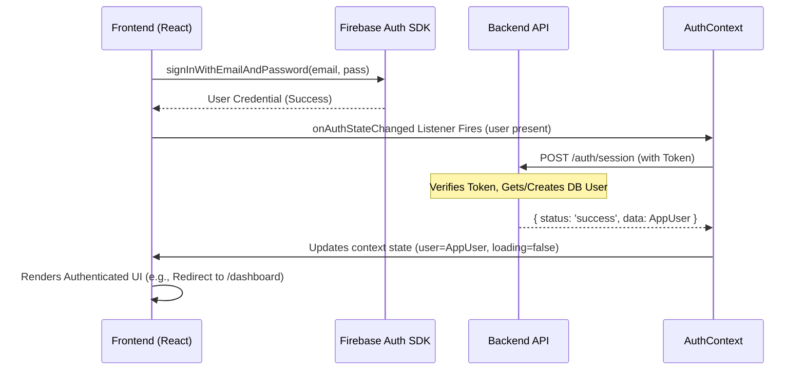
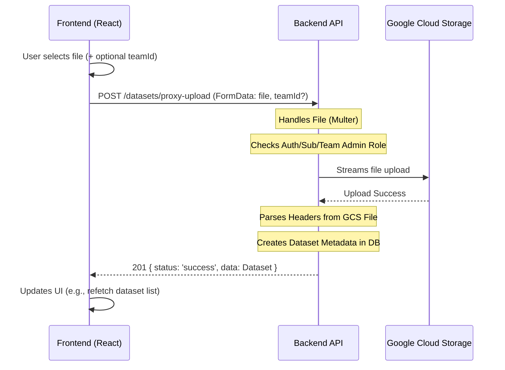
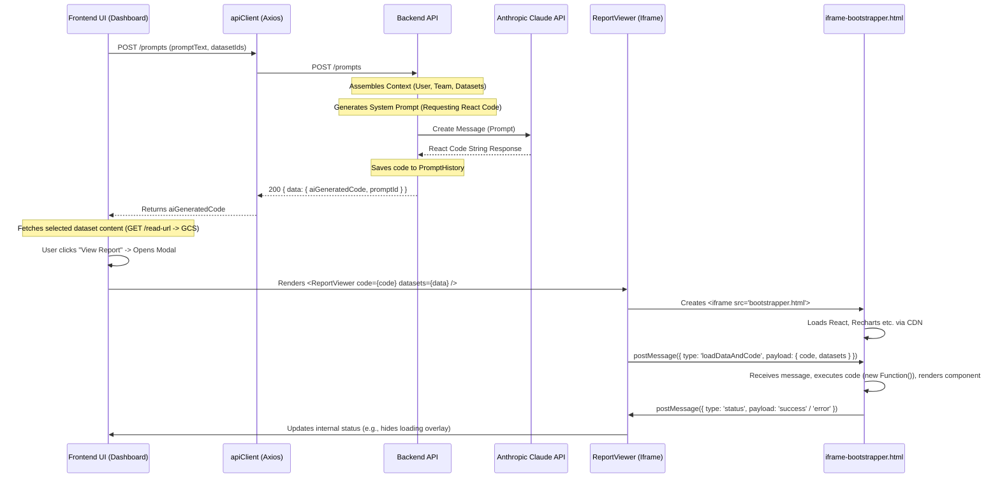
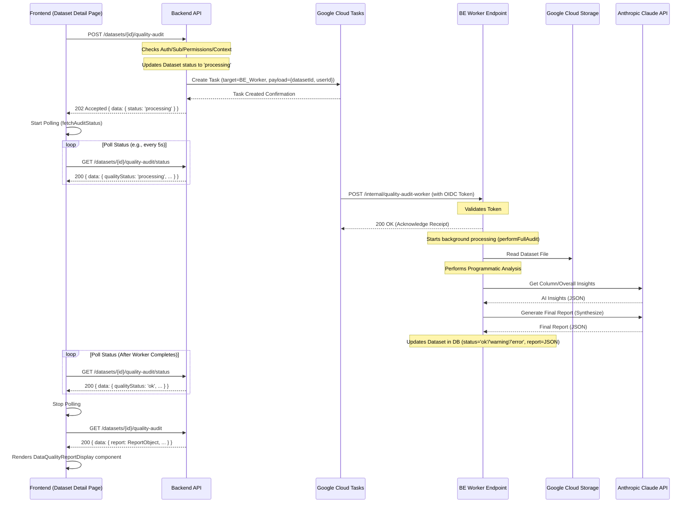
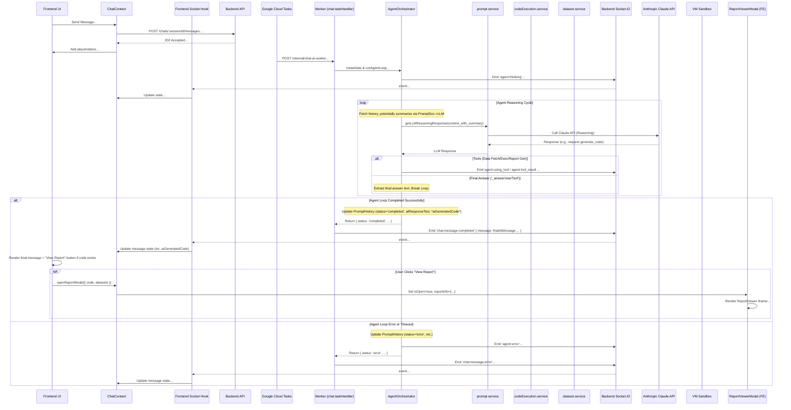

# NeuroLedger Application Architecture

**Last Updated:** (Current Date)

## 1. Overview

NeuroLedger is a web application designed for AI-powered financial analysis. It comprises a React frontend and a Node.js/Express backend, interacting via a RESTful API and WebSockets. The architecture emphasizes modularity through a Vertical Slice Architecture (VSA) pattern implemented in both the frontend and backend codebases.

*   **Frontend:** React (using Vite), Tailwind CSS, React Router, Axios, Firebase JS SDK, Socket.IO Client.
*   **Backend:** Node.js, Express, MongoDB (with Mongoose), Firebase Admin SDK, Google Cloud Storage (GCS), Google Cloud Tasks, Anthropic Claude API Client, Socket.IO Server.
*   **Core Pattern:** Vertical Slice Architecture (VSA).

## 2. High-Level Structure

The project is divided into two main packages:

*   **`frontend/`**: Contains the React single-page application (SPA). See `frontend/README.md` for setup and structure details.
*   **`backend/`**: Contains the Node.js/Express API server. See `backend/README.md` for setup and structure details.

Interaction between these two parts is defined by the API contract (`frontend/FE_BE_INTERACTION_README.md`) and WebSocket events (defined in `AI-Improvement-Plan.md` and implemented in `backend/src/features/chat/agent.service.js`).

## 3. Backend Architecture (`backend/`)

The backend follows a VSA pattern, organizing code by feature slices rather than technical layers. The `chat` feature now includes an `agent.service.js` for orchestration.

Agent service now includes report generation and history summarization capabilities.

```mermaid
graph TD
    A[Client Request] --> B(Express App);
    B --> C{Middleware Chain};
    C -- CORS, JSON, Logging --> D{Auth Middleware};
    D -- /api/v1/** --> E{Subscription Middleware};
    E -- /api/v1/** --> F(Feature Router);
    F -- /api/v1/chat --> G_Chat[chat.controller];
    subgraph Feature Slice (./src/features/chat)
        G_Chat --> H_Chat(chat.service); // For session mgmt
        H_Chat --> I{Database (MongoDB)};
        H_Chat --> T(Cloud Tasks);
        G_Chat --> TaskHandler(chat.taskHandler) // Entry point for worker
        TaskHandler --> Agent(agent.service)
        Agent -- uses --> PS(prompt.service);
        Agent -- uses --> DS(dataset.service);
        Agent -- uses --> CES(codeExecution.service);
        Agent --> I; // Updates PromptHistory (with text & report code)
        PS --> Claude(External APIs - Claude); // For reasoning, code gen, report gen
        CES -- uses --> DS;
        CES -- runs code --> Sandbox(vm Module);
        Agent --> WS(Socket.IO Emitter);
    end
    I --> H_Chat;
    T --> BE_Worker(POST /internal/chat-ai-worker);
    BE_Worker --> TaskHandler;
    H_Chat --> F;
    G_Chat --> F;
    F --> E;
    E --> D;
    D --> C;
    C --> B;
    B --> K[Client Response];

    subgraph Global Middleware
        C
        D
        E
    end

    subgraph Shared Infrastructure (./src/shared, ./src)
        I
        Claude
        T
        WS
        DS
        CES
        L(Error Handler)
    end

    %% Error Flow
    G_Chat -- Error --> L;
    H_Chat -- Error --> L;
    TaskHandler -- Error --> L;
    Agent -- Error --> L;
    CES -- Error --> Agent; // Execution errors reported back
    F -- Error --> L;
    E -- Error --> L;
    D -- Error --> L;
    C -- Error --> L;
    L --> B;
```

*   **Entry Point:** `backend/src/server.js` initializes DB, Socket.IO (`./src/socket.js`), and Express server (`app.js`).
*   **Application Core (`backend/src/app.js`):** Configures Express, middleware, API router (`./routes.js`), error handler.
*   **Routing (`backend/src/routes.js`):** Mounts feature routers.
*   **Middleware (`backend/src/shared/middleware/`)**: Includes `auth`, `subscription`, `cloudTask`, `error` handlers.
*   **Features (`backend/src/features/`)**: Contains feature logic.
    *   `auth`: Session management.
    *   `chat`: Handles persistent chat sessions. `agent.service.js` orchestrates reasoning and tool use (data awareness, code gen/exec, report gen). **Includes logic (`_prepareChatHistory`) to trigger history summarization via `prompt.service.js`**. `prompt.service.js` now includes `summarizeChatHistory` function.
    *   `dataQuality`: Async dataset audits.
    *   `datasets`: Metadata management, **provides raw data fetching (`getRawDatasetContent`) for code execution**. Used by agent tools.
    *   `notifications`: User notifications.
    *   `subscriptions`: Dummy subscription management.
    *   `teams`: Team management.
    *   `users`: User profile management.
*   **Shared Modules (`backend/src/shared/`)**: Common infrastructure.
    *   `services`: **Now includes `codeExecution.service.js` implementing the sandboxed `vm` execution.**
    *   (Other shared: config, db, external_apis, utils - no change)
*   **Socket.IO (`backend/src/socket.js`):** Initializes Socket.IO server, handles connection auth, provides `getIO()` and `emitToUser()`. Used by `agent.service.js` to emit real-time agent status updates.
*   **Database Models:** Mongoose schemas (e.g., `User`, `Dataset`, `Team`, `ChatSession`, `PromptHistory`). `PromptHistory` now stores `aiGeneratedCode` (React report code).
*   **Asynchronous Tasks:** Google Cloud Tasks triggers `POST /internal/chat-ai-worker`, which is handled by `chat.taskHandler.js` to initiate the `AgentOrchestrator`.

## 4. Frontend Architecture (`frontend/`)

The frontend is a React SPA built with Vite, styled with Tailwind CSS, following VSA principles.

```mermaid
graph LR
    A[User Interaction] --> B(React Components);
    B --> C{Routing (React Router)};
    C --> D[Layout Components];
    D --> E(Page Components);
    B --> F(State Management);
    F -- Global --> G[Context API (Auth, Theme)];
    F -- Local --> H[Component State (useState)];
    F -- Feature --> I[Custom Hooks/Context (e.g., ChatContext)];
    I --> ReportModal(ReportViewerModal) // Context renders modal
    B --> J{API Calls};
    J --> K(apiClient - Axios);
    K -- Request Interceptor --> L(Add Auth Token);
    L --> M[Backend API];
    M --> K;
    K -- Response Interceptor --> J;
    J --> F; 
    J --> B; 

    subgraph Real-time Updates
       BE_Socket[Backend Socket.IO] -- agent:* / chat:message:* events --> FE_Socket(Frontend Socket Hook);
       FE_Socket --> I; %% ChatContext updates state
       I --> B; %% Trigger UI re-render
       I -- controls --> ReportModal; // Context controls modal visibility/data
    end

    subgraph Core Structure (./src)
        C
        D
        G
        K
    end

    subgraph Features (./src/features)
        E
        I
        %% Specific Components
    end

    subgraph Shared (./src/shared)
       %% Shared Components
       %% Shared Hooks (useAuth, useTheme)
       %% UI Elements
    end
```

*   **Build Tool:** Vite (`frontend/vite.config.js`) provides fast development server and optimized production builds.
*   **Entry Point:** `frontend/index.html` is the root HTML file. `frontend/src/main.jsx` renders the React application using `ReactDOM.createRoot`.
*   **Root Component (`frontend/src/App.jsx`):** Sets up global context providers (`AuthProvider`, `ThemeProvider`). Renders the main router (`AppRouter`). See `frontend/src/README.md`.
*   **Routing (`frontend/src/routes.jsx`):** Uses `react-router-dom` v6 (`createBrowserRouter`) to define all application routes.
    *   Implements protected route logic (`ProtectedRoute`) checking auth and subscription status.
    *   Uses layout components (`AppLayout`, `CenteredLayout`) for different route groups.
    *   Lazy loads most page components using `React.lazy` and `Suspense`. See `frontend/src/README.md`.
*   **Layouts (`frontend/src/shared/layouts/`):**
    *   `AppLayout.jsx`: Main layout for authenticated users, includes `Sidebar` and sticky header. Manages sidebar collapse state. Integrates `NotificationBell` and `TutorialModal`.
    *   `CenteredLayout.jsx`: Split-screen layout for public pages (Login, Signup).
    *   See `frontend/src/shared/layouts/README.md`.
*   **State Management:**
    *   **Global:** React Context API for authentication (`AuthContext`) and theme (`ThemeContext`). Consumed via `useAuth` and `useTheme` hooks (`frontend/src/shared/hooks/`). See context and hook READMEs.
    *   **Feature/Server State:**
        *   **Chat:** Managed via `ChatContext` and `useChat` hook. Handles sessions, messages, loading states. **Crucially, now uses `useSocket` hook to listen for new `agent:*` events (`agent:thinking`, `agent:using_tool`, `agent:tool_result`, `agent:error`) in addition to the final `chat:message:completed` and `chat:message:error` events. Updates message-specific status based on these events.**
        *   **Other Features:** Often managed within feature-specific custom hooks (e.g., `useDatasets`, `useTeamInvites`, `useNotifications`) that handle API calls, loading, and error states. SWR or React Query could be alternatives for more complex caching/refetching needs.
    *   **Local UI State:** Managed within components using `useState`, `useReducer`.
*   **API Interaction (`frontend/src/shared/services/apiClient.js`):**
    *   An `axios` instance is configured with the base backend URL (`VITE_API_BASE_URL`).
    *   A **request interceptor** automatically attaches the Firebase Auth ID token (`Authorization: Bearer`) to outgoing requests.
    *   A response interceptor provides basic error logging (e.g., for 401s).
    *   See `frontend/src/shared/services/README.md`.
*   **Styling:**
    *   Tailwind CSS is the primary styling engine (`frontend/tailwind.config.js`).
    *   Dark mode is implemented using Tailwind's `class` strategy, managed by `ThemeContext`.
    *   Global styles and custom Tailwind layers are defined in `frontend/src/index.css`.
    *   Base UI components (`frontend/src/shared/ui/`) provide reusable styled elements (Button, Card, Input, Modal etc.). See `frontend/src/shared/ui/README.md` and `frontend/UI_README.md`.
*   **Features (`frontend/src/features/`)**: Contain feature-specific pages, components, and hooks. See `frontend/src/features/README.md` and individual feature READMEs for details on:
    *   `account_management`: Layout/navigation for account sections.
    *   `auth`: Login/Signup forms and pages.
    *   `dashboard`: Main application view after login. Includes both standalone `ChatPage` and the integrated chat functionality in `DashboardPage`. The dashboard provides `ChatContext`, `useSocket` hook, and components for displaying messages, managing chat sessions, and enabling dataset-powered AI analysis. The `ChatInterface` displays messages while `PromptInput` handles user input and dataset selection (which becomes locked after the first message in a session). Triggers report display via modals.
    *   `dataQuality`: Components for displaying audit status and reports.
    *   `dataset_management`: Dataset upload, list, detail page, context editor.
    *   `notifications`: Notification bell and list display.
    *   `onboarding`: Tutorial modal logic.
    *   `report_display`: Iframe sandbox for rendering AI-generated React code.
    *   `subscription`: Dummy plan selection page.
    *   `team_management`: Team creation, list, details, member/invite management.
*   **Report Rendering (`frontend/src/features/report_display/`)**:
    *   Uses a **sandboxed iframe** approach for security when executing AI-generated code.
    *   `ReportViewer.jsx` creates an `<iframe>` with `sandbox="allow-scripts"`, loading `public/iframe-bootstrapper.html`.
    *   Code (`reportInfo.code`) and data (`reportInfo.datasets`) are passed into the iframe using `postMessage`. The data typically originates from the `reportDatasets` field of a completed AI `PromptHistory` message (received via API or WebSocket).
    *   `iframe-bootstrapper.html` loads React/libraries via CDN, executes the received code, renders the component within the iframe, and sends status back via `postMessage`.
    *   See `frontend/src/features/report_display/README.md`.

## 5. Key Interaction Flows

### Authentication Flow



### Dataset Proxy Upload Flow



### Prompt & Report Flow (Code Gen + Iframe)

**Note:** This flow describes the **standalone prompt feature** (`POST /prompts`), distinct from the chat interaction flow. The report rendering part (iframe) is reused by the chat feature when an AI message contains report data.



### Data Quality Audit Flow



### Chat Flow (Agent Architecture - Phase 3 + Refinements)



## 6. Environment & Configuration

*   Both frontend and backend rely on environment variables for configuration (API keys, database URIs, service URLs, etc.).
*   `.env` files are used for local development (see `.env.example` in both `frontend/` and `backend/`).
*   Frontend variables must be prefixed with `VITE_` (e.g., `VITE_FIREBASE_API_KEY`). See `frontend/README.md`.
*   Backend configuration is loaded via `backend/src/shared/config/index.js`, which validates required variables. See `backend/src/shared/config/README.md`.
*   Backend requires service account JSON files (`firebase-service-account.json`, `gcs-service-account.json`) placed in the `backend/` root directory for local development (see Security Note in `backend/src/shared/external_apis/README.md`).

This document provides a high-level blueprint. For specific implementation details, refer to the linked README files within each feature and shared module directory.
