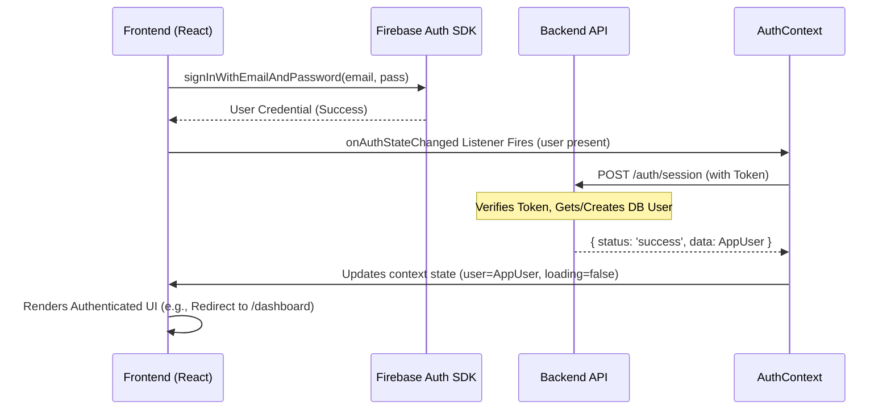
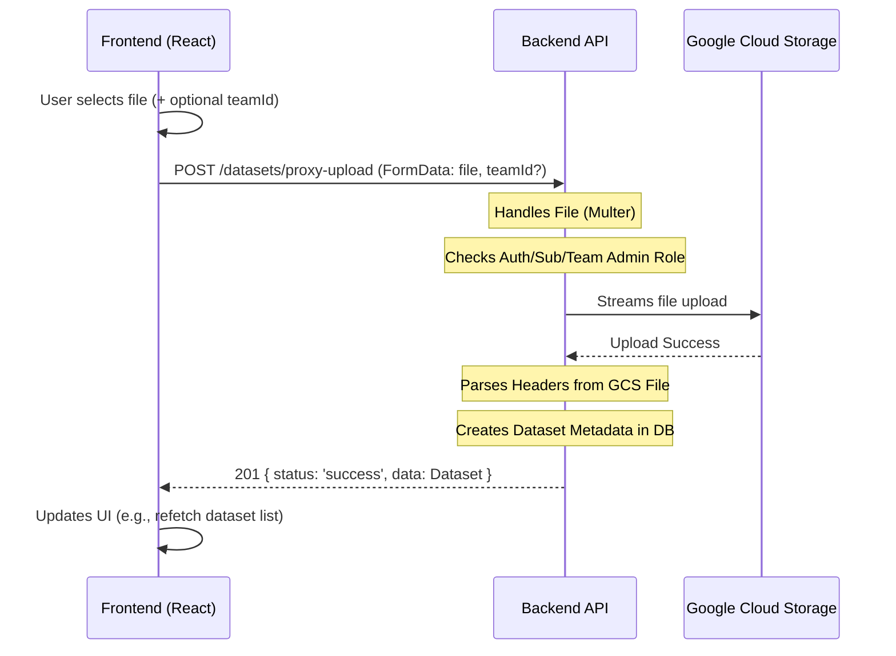
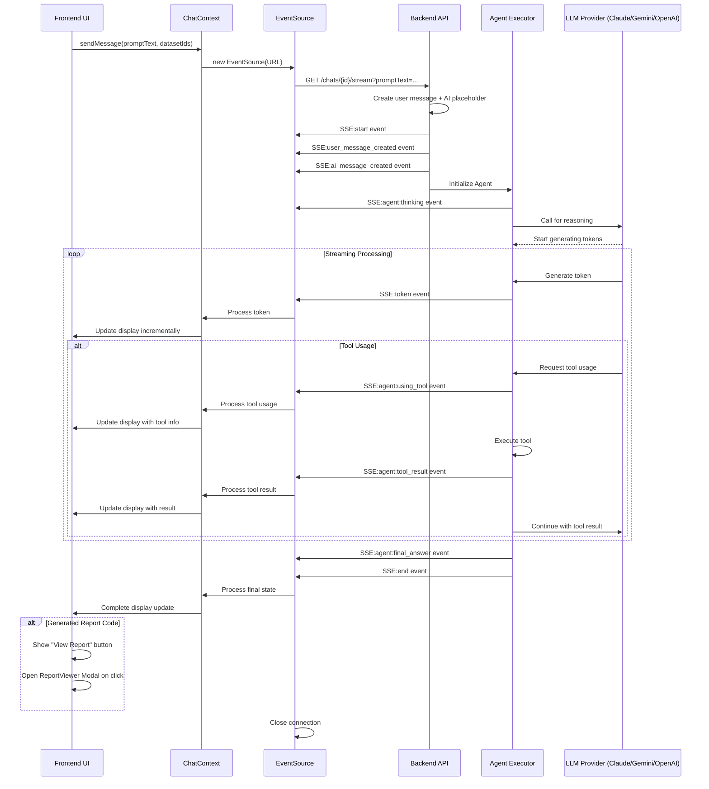
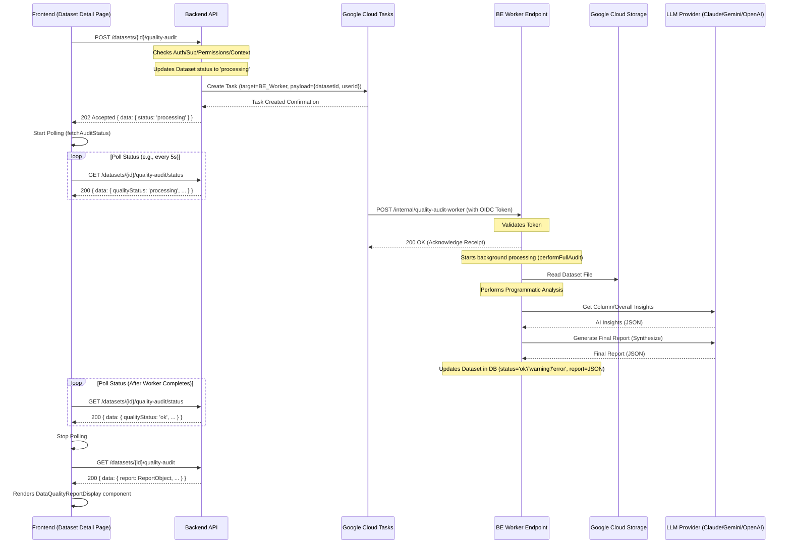

# NeuroLedger Application Architecture

**Last Updated:** April 16, 2025

## 1. Overview

NeuroLedger is a web application designed for AI-powered financial analysis. It comprises a React frontend and a Node.js/Express backend, interacting via a RESTful API, Server-Sent Events (SSE), and WebSockets. The architecture emphasizes modularity through a Vertical Slice Architecture (VSA) pattern implemented in both the frontend and backend codebases.

*   **Frontend:** React (using Vite), Tailwind CSS, React Router, Axios, Firebase JS SDK, Socket.IO Client.
*   **Backend:** Node.js, Express, MongoDB (with Mongoose), Firebase Admin SDK, Google Cloud Storage (GCS), Google Cloud Tasks, Multiple LLM Providers (Anthropic Claude, Google Gemini, OpenAI), Socket.IO Server.
*   **Core Pattern:** Vertical Slice Architecture (VSA).

## 2. High-Level Structure

The project is divided into two main packages:

*   **`frontend/`**: Contains the React single-page application (SPA). See `frontend/README.md` for setup and structure details.
*   **`backend/`**: Contains the Node.js/Express API server. See `backend/README.md` for setup and structure details.

Interaction between these two parts is defined by the API contract (`FE_BE_INTERACTION_README.md`) and real-time communication via WebSockets and Server-Sent Events (SSE).

## 3. Backend Architecture (`backend/`)

The backend follows a VSA pattern, organizing code by feature slices rather than technical layers. The `chat` feature implements an advanced agent orchestration system.

```mermaid
graph TD
    A[Client Request] --> B(Express App);
    B --> C{Middleware Chain};
    C -- CORS, JSON, Logging --> D{Auth Middleware};
    D -- /api/v1/** --> E{Subscription Middleware};
    E -- /api/v1/** --> F(Feature Router);
    F -- /api/v1/chat --> G_Chat[chat.controller];
    subgraph Feature Slice (./src/features/chat)
        G_Chat --> H_Chat(chat.service); // For session mgmt + SSE streaming
        H_Chat --> I{Database (MongoDB)};
        H_Chat --> T(Cloud Tasks);
        G_Chat --> TaskHandler(chat.taskHandler) // Entry point for worker
        TaskHandler --> RunAgent("agent.service (runAgent)")
        RunAgent --> AgentExecutor("AgentExecutor class")
        ContextSvc[agentContext.service] --> AgentExecutor
        AgentExecutor --> PS(prompt.service);
        AgentExecutor --> Tools("tools/ directory")
        PS --> LLMProviders("Claude/Gemini/OpenAI Clients")
        Tools --> DataSvc(dataset.service)
        Tools --> CodeExec(codeExecution.service)
        AgentExecutor --> I; // Updates PromptHistory
        AgentExecutor --> WS(Socket.IO & SSE Emitter);
    end
    I --> H_Chat;
    T --> BE_Worker(POST /internal/chat-ai-worker);
    BE_Worker --> TaskHandler;
    H_Chat --> F;
    G_Chat --> F;
    F --> E;
    E --> D;
    D --> C;
    C --> B;
    B --> K[Client Response];

    subgraph Global Middleware
        C
        D
        E
    end

    subgraph Shared Infrastructure (./src/shared, ./src)
        I
        LLMProviders
        T
        WS
        DataSvc
        CodeExec
        L(Error Handler)
    end

    %% Error Flow
    G_Chat -- Error --> L;
    H_Chat -- Error --> L;
    TaskHandler -- Error --> L;
    RunAgent -- Error --> L;
    F -- Error --> L;
    E -- Error --> L;
    D -- Error --> L;
    C -- Error --> L;
    L --> B;
```

*   **Entry Point:** `backend/src/server.js` initializes DB, Socket.IO (`./src/socket.js`), and Express server (`app.js`).
*   **Application Core (`backend/src/app.js`):** Configures Express, middleware, API router (`./routes.js`), error handler.
*   **Routing (`backend/src/routes.js`):** Mounts feature routers.
*   **Middleware (`backend/src/shared/middleware/`)**: Includes `auth`, `subscription`, `cloudTask`, `error` handlers.
*   **Features (`backend/src/features/`)**: Contains feature logic.
    *   `auth`: Session management.
    *   `chat`: Handles persistent chat sessions.
        * `chat.controller.js`: Routes handling, including streaming endpoints
        * `chat.service.js`: Chat session management, message handling, streaming via SSE
        * `chat.routes.js`: Route definitions
        * `chat.taskHandler.js`: Processes background tasks via Cloud Tasks
        * `agent.service.js`: Core agent orchestration, tools processing
        * `agent.utils.js`: Helper utilities for agent operations
        * `agentContext.service.js`: Context preparation for agent
        * `prompt.service.js`: LLM interactions (Claude/Gemini/OpenAI)
        * `system-prompt-template.js`: Template for agent instructions
        * `chatSession.model.js` & `prompt.model.js`: Data models
        * `tools/`: Directory of modular AI tools
          * `tool.definitions.js`: Defines available tools
          * Individual tool implementations (list_datasets.js, parse_csv_data.js, etc.)
    *   `dataQuality`: Async dataset audits.
    *   `datasets`: Metadata management, provides raw data access for code execution.
    *   `notifications`: User notifications.
    *   `subscriptions`: Dummy subscription management.
    *   `teams`: Team management.
    *   `users`: User profile management.
*   **Shared Modules (`backend/src/shared/`)**: Common infrastructure.
    *   `services`: Includes `codeExecution.service.js` for sandboxed `vm` execution.
    *   `external_apis`: Contains client integrations for Claude, Gemini, OpenAI, etc.
    *   `config`, `db`, `utils`: Supporting infrastructure
*   **Socket.IO & SSE (`backend/src/socket.js`):** Initializes Socket.IO server, handles connection auth, provides `getIO()` and `emitToUser()`. Used by `agent.service.js` to emit real-time status updates.
*   **Database Models:** Mongoose schemas (e.g., `User`, `Dataset`, `Team`, `ChatSession`, `PromptHistory`). `PromptHistory` now stores `aiGeneratedCode`, `reportAnalysisData`, `steps`, and `messageFragments`.
*   **Asynchronous Tasks:** Google Cloud Tasks triggers `POST /internal/chat-ai-worker`, which is handled by `chat.taskHandler.js` to initiate the agent.

## 4. Frontend Architecture (`frontend/`)

The frontend is a React SPA built with Vite, styled with Tailwind CSS, following VSA principles.

```mermaid
graph LR
    A[User Interaction] --> B(React Components);
    B --> C{Routing (React Router)};
    C --> D[Layout Components];
    D --> E(Page Components);
    B --> F(State Management);
    F -- Global --> G[Context API (Auth, Theme)];
    F -- Local --> H[Component State (useState)];
    F -- Feature --> I[Custom Hooks/Context (e.g., ChatContext)];
    I --> ReportModal(ReportViewerModal) // Context renders modal
    B --> J{API Calls};
    J --> K(apiClient - Axios);
    K -- Request Interceptor --> L(Add Auth Token);
    L --> M[Backend API];
    M --> K;
    K -- Response Interceptor --> J;
    J --> F; 
    J --> B; 

    subgraph Real-time Updates
       BE_API[Backend API] -- SSE Stream --> SSE_Client(SSE Event Source)
       BE_Socket[Backend Socket.IO] -- WebSocket Events --> FE_Socket(Frontend Socket Hook);
       SSE_Client --> I; %% ChatContext updates state from SSE
       FE_Socket --> I; %% ChatContext updates state from Socket
       I --> B; %% Trigger UI re-render
       I -- controls --> ReportModal; // Context controls modal visibility/data
    end

    subgraph Core Structure (./src)
        C
        D
        G
        K
    end

    subgraph Features (./src/features)
        E
        I
        %% Specific Components
    end

    subgraph Shared (./src/shared)
       %% Shared Components
       %% Shared Hooks (useAuth, useTheme)
       %% UI Elements
    end
```

*   **Build Tool:** Vite (`frontend/vite.config.js`) provides fast development server and optimized production builds.
*   **Entry Point:** `frontend/index.html` is the root HTML file. `frontend/src/main.jsx` renders the React application using `ReactDOM.createRoot`.
*   **Root Component (`frontend/src/App.jsx`):** Sets up global context providers (`AuthProvider`, `ThemeProvider`). Renders the main router (`AppRouter`).
*   **Routing (`frontend/src/routes.jsx`):** Uses `react-router-dom` v6 (`createBrowserRouter`) to define all application routes.
    *   Implements protected route logic (`ProtectedRoute`) checking auth and subscription status.
    *   Uses layout components (`AppLayout`, `CenteredLayout`) for different route groups.
    *   Lazy loads most page components using `React.lazy` and `Suspense`.
*   **Layouts (`frontend/src/shared/layouts/`):**
    *   `AppLayout.jsx`: Main layout for authenticated users, includes `Sidebar` and sticky header.
    *   `CenteredLayout.jsx`: Split-screen layout for public pages (Login, Signup).
*   **State Management:**
    *   **Global:** React Context API for authentication (`AuthContext`) and theme (`ThemeContext`). Consumed via `useAuth` and `useTheme` hooks.
    *   **Feature/Server State:**
        *   **Chat:** Managed via `ChatContext` and `useChat` hook. Handles sessions, messages, loading states. Integrates both WebSocket events and SSE streams.
        *   **Other Features:** Managed within feature-specific custom hooks (e.g., `useDatasets`, `useTeamInvites`).
    *   **Local UI State:** Managed within components using `useState`, `useReducer`.
*   **API Interaction (`frontend/src/shared/services/apiClient.js`):**
    *   An `axios` instance is configured with the base backend URL (`VITE_API_BASE_URL`).
    *   A request interceptor automatically attaches the Firebase Auth ID token to outgoing requests.
    *   A response interceptor provides basic error logging.
*   **Real-Time Communication:**
    *   **WebSockets:** Socket.IO client for traditional event-based updates.
    *   **SSE:** EventSource for streaming chat responses in real-time.
*   **Styling:**
    *   Tailwind CSS is the primary styling engine (`frontend/tailwind.config.js`).
    *   Dark mode is implemented using Tailwind's `class` strategy, managed by `ThemeContext`.
    *   Global styles and custom Tailwind layers are defined in `frontend/src/index.css`.
    *   Base UI components (`frontend/src/shared/ui/`) provide reusable styled elements.
*   **Features (`frontend/src/features/`)**: Contain feature-specific pages, components, and hooks.
    *   `account_management`: Layout/navigation for account sections.
    *   `auth`: Login/Signup forms and pages.
    *   `dashboard`: Main application view after login. Includes both standalone `ChatPage` and the integrated chat functionality in `DashboardPage`. The dashboard provides `ChatContext`, handles both WebSocket and SSE events, and manages components for displaying messages, chat sessions, and enabling dataset-powered AI analysis.
    *   `dataQuality`: Components for displaying audit status and reports.
    *   `dataset_management`: Dataset upload, list, detail page, context editor.
    *   `notifications`: Notification bell and list display.
    *   `onboarding`: Tutorial modal logic.
    *   `report_display`: Iframe sandbox for rendering AI-generated React code.
    *   `subscription`: Dummy plan selection page.
    *   `team_management`: Team creation, list, details, member/invite management.
*   **Report Rendering (`frontend/src/features/report_display/`)**:
    *   Uses a sandboxed iframe approach for security when executing AI-generated code.
    *   `ReportViewer.jsx` creates an `<iframe>` with `sandbox="allow-scripts"`, loading `public/iframe-bootstrapper.html`.
    *   Code (`reportInfo.code`) and data (`reportInfo.datasets`) are passed into the iframe using `postMessage`.
    *   `iframe-bootstrapper.html` loads React/libraries via CDN, executes the received code, renders the component within the iframe, and sends status back via `postMessage`.

## 5. Key Interaction Flows

### Authentication Flow



### Dataset Proxy Upload Flow



### Chat Interaction - Streaming Flow (SSE)



### Data Quality Audit Flow



## 6. Environment & Configuration

*   Both frontend and backend rely on environment variables for configuration (API keys, database URIs, service URLs, etc.).
*   `.env` files are used for local development (see `.env.example` in both `frontend/` and `backend/`).
*   Frontend variables must be prefixed with `VITE_` (e.g., `VITE_FIREBASE_API_KEY`).
*   Backend configuration is loaded via `backend/src/shared/config/index.js`, which validates required variables.
*   Backend requires service account JSON files (`firebase-service-account.json`, `gcs-service-account.json`) placed in the `backend/` root directory for local development.

## 7. Multi-Provider LLM Support

The application now supports multiple LLM providers:

* **Anthropic Claude**: Primary provider with the Claude 3.7 Sonnet model.
* **Google Gemini**: Alternative provider with Gemini Pro models.
* **OpenAI**: Alternative provider with GPT models.

User preferences are stored in the `preferredAiModel` setting in the User model. The backend service automatically selects the appropriate provider client based on this preference, with fallback mechanisms for unavailable providers.

Model configuration is managed in `prompt.service.js`, with specific model selections for each provider's functions (reasoning, code generation, report generation).

## 8. Security Considerations

* **Authentication**: Firebase Authentication with JWT verification.
* **Authorization**: Role-based access control for teams and resources.
* **Secure Code Execution**:
  * Backend uses Node.js `vm` module with restricted context.
  * Frontend uses sandboxed iframes for rendering AI-generated React code.
* **API Protection**:
  * Input validation on all endpoints.
  * Rate limiting on sensitive endpoints.
  * CORS restriction to trusted origins.
* **Internal Endpoints**: Protected by Cloud Tasks OIDC token validation.
* **Prompt Injection**: System prompts designed to minimize risks of prompt injection.

## 9. Performance Considerations

* **Streaming Responses**: Chat responses stream in real-time via SSE for better user experience.
* **Background Processing**: Asynchronous processing via Cloud Tasks for compute-intensive operations.
* **Frontend Optimizations**:
  * Code splitting via `React.lazy()` for reduced initial load time.
  * Memoization of expensive computations and renders.
* **Backend Optimizations**:
  * Database indexes for efficient queries.
  * Pagination for list endpoints.
  * Query optimization for MongoDB operations.