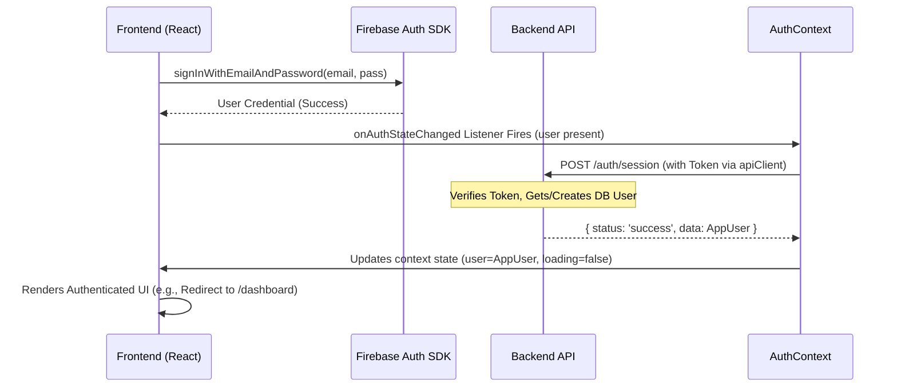
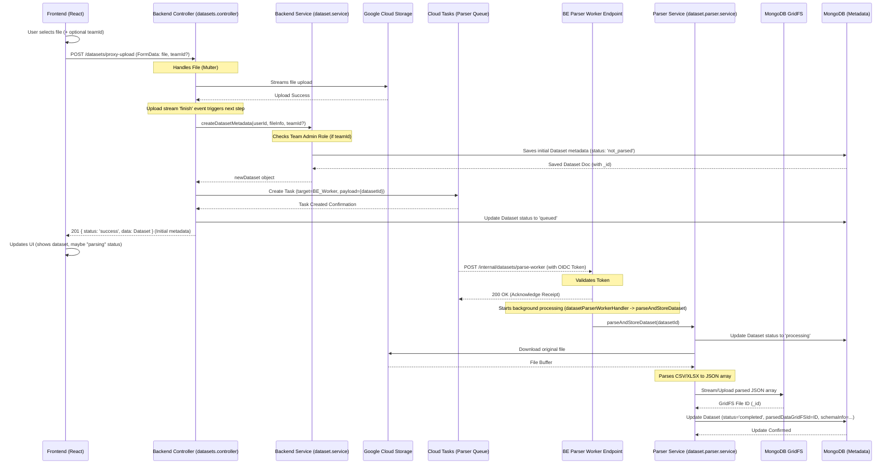

# NeuroLedger Application Architecture

**Last Updated:** May 5, 2025

## 1. Overview

NeuroLedger is a web application designed for AI-powered financial analysis. It comprises a React frontend and a Node.js/Express backend, interacting via a RESTful API and Server-Sent Events (SSE) for real-time chat updates. The architecture emphasizes modularity through a Vertical Slice Architecture (VSA) pattern implemented in both the frontend and backend codebases.

A key feature is the asynchronous processing of uploaded datasets. After upload, a background task parses the data (CSV, XLSX) and stores the resulting JSON structure in MongoDB GridFS. The AI chat agent then retrieves this pre-parsed data for analysis, improving performance and efficiency during chat interactions.

*   **Frontend:** React (using Vite), Tailwind CSS, React Router, Axios, Firebase JS SDK, `@microsoft/fetch-event-source`.
*   **Backend:** Node.js, Express, MongoDB (with Mongoose and GridFS for parsed data), Firebase Admin SDK, Google Cloud Storage (GCS), Google Cloud Tasks, Multiple LLM Providers (Anthropic Claude, Google Gemini, OpenAI via ProviderFactory), Node.js `vm` module for sandboxed code execution.
*   **Core Pattern:** Vertical Slice Architecture (VSA).

## 2. High-Level Structure

The project is divided into two main packages:

*   **`frontend/`**: Contains the React single-page application (SPA). See `frontend/README.md` for setup and structure details.
*   **`backend/`**: Contains the Node.js/Express API server. See `backend/README.md` for setup and structure details.

Interaction between these two parts is defined by the API contract (`FE_BE_INTERACTION_README.md`) and real-time communication via Server-Sent Events (SSE) for chat.

## 3. Backend Architecture (`backend/`)

The backend follows a VSA pattern, organizing code by feature slices. The `chat` feature implements an advanced AI agent orchestration system, while the `datasets` feature handles asynchronous parsing and storage.

```mermaid
graph TD
    A[Client Request] --> B(Express App);
    B --> C{Middleware Chain};
    C -- CORS, JSON, Logging --> D{Auth Middleware};
    D -- /api/v1/** --> E{Subscription Middleware};
    E -- /api/v1/** --> F(Feature Router);

    subgraph Feature Slice - Chat (./src/features/chat)
        F -- /api/v1/chats/... --> G_Chat[chat.controller];
        G_Chat -- GET /stream --> H_Chat_Stream(chat.service - handleStreamingChatRequest);
        G_Chat -- POST /messages --> H_Chat_Task(chat.service - addMessage);
        H_Chat_Task --> T_Chat(Cloud Tasks - Chat AI);

        H_Chat_Stream --> RunAgent("agent.service (runAgent)");
        ChatTaskHandler --> RunAgent;

        subgraph Agent System (agent.service, agent/, tools/)
            RunAgent --> AR(AgentRunner);
            AR --> ACS(agentContext.service);
            AR --> ASM(AgentStateManager);
            AR --> AEE(AgentEventEmitter);
            AR --> LLMO(LLMOrchestrator);
            AR --> TE(ToolExecutor);

            %% Agent Context & Data Retrieval
            ACS --> I{Database (MongoDB)};
            ACS --> DSvc(dataset.service); %% For schema, metadata
            ACS --> PS(prompt.service); %% For history summary

            %% LLM Interaction
            LLMO --> SPB(SystemPromptBuilder);
            LLMO --> PS; %% For LLM calls

            %% Tool Execution
            TE --> ToolWrapper(BaseToolWrapper);
            ToolWrapper --> ToolSchemas(tool.schemas.js);
            ToolWrapper --> ToolImpl("tools/*.js");

            %% Tool Dependencies
            ToolImpl -- execute_analysis_code --> CodeExec(codeExecution.service);
            ToolImpl -- calculate_financial_ratios --> DSvc_ParsedData["dataset.service (getParsedDataFromStorage)"]; %% Get parsed data
            ToolImpl -- get_dataset_schema --> DSvc; %% Get schema metadata
            ToolImpl -- generate_..._code --> PS; %% LLM calls for code gen
            ToolImpl -- list_datasets --> DSvc; %% List metadata

            %% Agent State & Events
            ASM --> I; %% AgentRunner updates PromptHistory via StateManager
            AEE -- SSE Callback --> H_Chat_Stream;
        end

        %% Shared Services Used by Agent/Chat
        PS --> LLMProviders("Claude/Gemini/OpenAI Clients");
        CodeExec --> VM(Node.js vm Module);
        DSvc_ParsedData --> GridFS[(MongoDB GridFS)]; %% Read parsed data

        G_Chat --> I; // Session/Message CRUD via chat.service
    end

    subgraph Feature Slice - Datasets (./src/features/datasets)
        F -- /api/v1/datasets/... --> DatasetsCtrl(datasets.controller);
        DatasetsCtrl -- POST /proxy-upload --> GCS_Upload["GCS Upload (Stream)"];
        DatasetsCtrl -- POST / --> DSvc_Meta(dataset.service - createDatasetMetadata);
        GCS_Upload --> DSvc_Meta;
        DSvc_Meta --> I; %% Save initial metadata
        DSvc_Meta --> T_Parse(Cloud Tasks - Parser); %% Trigger parsing task

        DatasetsCtrl -- GET /:id/schema --> DSvc;
        DatasetsCtrl -- GET / --> DSvc; %% List datasets
        DatasetsCtrl -- DELETE /:id --> DSvc_Delete(dataset.service - deleteDatasetById);
        DSvc_Delete --> GCS_Delete["GCS Delete (Original)"];
        DSvc_Delete --> GridFS_Delete["GridFS Delete (Parsed)"];
        DSvc_Delete --> I; %% Delete metadata

        DSvc --> GCS(Google Cloud Storage); %% For original file URLs, headers
        DSvc --> I; %% Read/Write metadata
    end

     subgraph Feature Slice - Data Quality (./src/features/dataQuality)
        F -- /api/v1/datasets/:id/quality-audit --> DQCtrl(dataQuality.controller);
        DQCtrl -- POST --> DQ_Task(Cloud Tasks - Quality Audit);
        DQCtrl -- GET /status --> I;
        DQCtrl -- GET / --> I;
        DQCtrl -- DELETE --> I;
     end

    subgraph Other Features (./src/features/*)
        F -- /api/v1/teams --> Teams(teams.controller);
        Teams --> TeamSvc(teams.service);
        TeamSvc --> I;
        F -- /api/v1/users --> Users(users.controller);
        Users --> I;
        %% ... other feature routes ...
    end

    subgraph Background Task Handling
        %% Chat Worker
        T_Chat -- Triggers --> BE_ChatWorker(POST /internal/chat-ai-worker);
        BE_ChatWorker --> ChatTaskAuth(CloudTask Middleware);
        ChatTaskAuth --> ChatTaskHandler(chat.taskHandler);

        %% Dataset Parser Worker
        T_Parse -- Triggers --> BE_ParseWorker(POST /internal/datasets/parse-worker);
        BE_ParseWorker --> ParseTaskAuth(CloudTask Middleware);
        ParseTaskAuth --> ParseTaskHandler(datasets.taskHandler);
        ParseTaskHandler --> ParseService(datasets.parser.service);
        ParseService --> GCS; %% Read original file
        ParseService --> GridFS; %% Write parsed JSON
        ParseService --> I; %% Update dataset status/GridFS ID

         %% Data Quality Worker
         DQ_Task -- Triggers --> BE_DQWorker(POST /internal/quality-audit-worker);
         BE_DQWorker --> DQTaskAuth(CloudTask Middleware);
         DQTaskAuth --> DQTaskHandler(dataQuality.controller - handleWorkerRequest);
         DQTaskHandler --> DQService(dataQuality.service - performFullAudit);
         DQService --> GCS; %% Read original file
         DQService --> LLMProviders; %% AI interpretation
         DQService --> I; %% Update dataset report/status
    end

    subgraph Shared Infrastructure (./src/shared, ./src)
        I
        GridFS
        LLMProviders
        T_Chat
        T_Parse
        DQ_Task
        GCS
        VM
        L(Error Handler)
    end

    %% Connections
    G_Chat --> F; F --> E; E --> D; D --> C; C --> B;
    DatasetsCtrl --> F;
    DQCtrl --> F;
    Teams --> F; Users --> F;
    B --> K[Client Response / SSE Stream];

    %% Error Flow
    G_Chat -- Error --> L; H_Chat_Stream -- Error --> L; ChatTaskHandler -- Error --> L; RunAgent -- Error --> L;
    DatasetsCtrl -- Error --> L; ParseTaskHandler -- Error --> L; ParseService -- Error --> L; DSvc_Delete -- Error --> L;
    DQCtrl -- Error --> L; DQTaskHandler -- Error --> L; DQService -- Error --> L;
    F -- Error --> L; E -- Error --> L; D -- Error --> L; C -- Error --> L;
    L --> B;

```

**Entry Point:** `backend/src/server.js` initializes DB, Socket.IO (though primarily using SSE now), and Express server (`app.js`).

**Application Core (`backend/src/app.js`):** Configures Express, middleware, API router (`./routes.js`), error handler.

**Routing (`backend/src/routes.js`):** Mounts feature routers (e.g., `/auth`, `/datasets`, `/chat`) under `/api/v1`. Also mounts internal worker routes (e.g., `/internal/chat-ai-worker`, `/internal/datasets/parse-worker`).

**Middleware (`backend/src/shared/middleware/`):** Includes auth (`protect`), subscription (`requireActiveSubscription`), Cloud Task OIDC token validation (`validateCloudTaskToken`), error handlers.

**Features (`backend/src/features/`):** Contains feature logic.

*   **`auth`**: Session management via Firebase tokens.
*   **`chat`**: Handles persistent chat sessions and AI agent interactions.
    *   `chat.controller.js`: Handles session CRUD, message retrieval, streaming endpoint (`/stream`), non-streaming message submission (`/messages`), and internal worker endpoint (`/internal/chat-ai-worker`).
    *   `chat.service.js`: Manages chat session logic, initiates agent runs (`handleStreamingChatRequest`), handles non-streaming message queuing (`addMessage`), and provides SSE streaming helpers.
    *   `chat.taskHandler.js`: Processes background tasks from Cloud Tasks for non-streaming agent runs, calling `agent.service.runAgent`.
    *   `agent.service.js`: Exports the main `runAgent` function which instantiates and runs the `AgentRunner`.
    *   `agent/` directory: Contains the core agent components (`AgentRunner`, `AgentStateManager`, `ToolExecutor`, `LLMOrchestrator`, `SystemPromptBuilder`, `AgentEventEmitter`, `AgentContextService`).
    *   `prompt.service.js`: Interacts with LLM providers for reasoning, code generation, and history summarization.
    *   `tools/` directory: Contains modular AI tool implementations (`list_datasets`, `get_dataset_schema`, `generate_analysis_code`, `execute_analysis_code`, `generate_report_code`, `calculate_financial_ratios`, `ask_user_for_clarification`, `_answerUserTool`, *modified* `parse_csv_data` (status check)). Includes definitions, schemas (`tool.schemas.js`), and `BaseToolWrapper`.
    *   `chatSession.model.js` & `prompt.model.js`: Data models for sessions and messages.
*   **`dataQuality`**: Async dataset audits via Cloud Tasks. Reads original data from GCS, uses LLMs for insights, saves report to MongoDB.
*   **`datasets`**:
    *   Handles dataset metadata management (CRUD), ownership, and team sharing.
    *   Interacts with GCS for original file uploads (direct/proxy) and generating read URLs.
    *   **Triggers background parsing task** via Cloud Tasks upon successful upload/metadata creation.
    *   `dataset.parser.service.js`: Contains logic to download original file from GCS, parse CSV/XLSX, and stream parsed JSON to **MongoDB GridFS**. Updates dataset status.
    *   `dataset.taskHandler.js`: Handles Cloud Task invocation for the parser worker.
    *   `dataset.service.js`: Provides functions to retrieve **pre-parsed data** from GridFS (`getParsedDataFromStorage`) for use by the chat agent and potentially other features. Also handles deletion of original GCS file and parsed GridFS file.
*   **`export`**: PDF generation service (using Puppeteer).
*   **`notifications`**: User notifications (e.g., for team invites).
*   **`subscriptions`**: (Dummy) Subscription management and access control.
*   **`teams`**: Team creation, membership, invites, permissions.
*   **`users`**: User profile, settings (including preferred AI model).

**Shared Modules (`backend/src/shared/`):** Common infrastructure.

*   `services`: Includes `codeExecution.service.js` (sandboxed `vm` execution), `cloudTasks.service.js`.
*   `llm_providers`: Abstraction layer (`BaseLLMProvider`, `ProviderFactory`) and specific clients (Claude, Gemini, OpenAI).
*   `external_apis`: Other external clients (Firebase Admin, GCS).
*   `config`, `db`, `utils`: Supporting infrastructure.

**Real-time:** Primarily uses Server-Sent Events (SSE) via `chat.service` and `AgentEventEmitter` for streaming agent responses. Socket.IO is initialized but less central.

**Asynchronous Tasks:** Google Cloud Tasks trigger:
*   `/internal/chat-ai-worker` for non-streaming agent runs.
*   `/internal/datasets/parse-worker` for parsing uploaded datasets and storing results in GridFS.
*   `/internal/quality-audit-worker` for data quality analysis.

## 4. Frontend Architecture (`frontend/`)

*(No significant changes to the frontend architecture diagram itself, but the description of interactions with datasets would change)*

The frontend is a React SPA built with Vite, styled with Tailwind CSS, following VSA principles where applicable.

```mermaid
graph LR
    A[User Interaction] --> B(React Components);
    B --> C{Routing (React Router)};
    C --> D[Layout Components - AppLayout, CenteredLayout];
    D --> E(Page Components - DashboardPage, Account Pages, etc.);
    B --> F(State Management);
    F -- Global --> G[Context API - AuthContext, ThemeContext];
    F -- Feature --> I[Custom Hooks/Context - ChatContext, useDatasets, useTeams];
    I --> ReportModal(ReportViewerModal) // ChatContext renders modal
    B --> J{API Calls};
    J --> K(apiClient - Axios);
    K -- Request Interceptor --> L(Add Auth Token);
    L --> M[Backend API];
    M --> K;
    K -- Response Interceptor --> J;
    J --> F;
    J --> B;

    subgraph Real-time Updates
       BE_API[Backend API] -- SSE Stream --> SSE_Client(fetchEventSource Hook in ChatContext)
       SSE_Client --> I; %% ChatContext updates state from SSE
       I --> B; %% Trigger UI re-render
       I -- controls --> ReportModal; // Context controls modal visibility/data
    end

    subgraph Core Structure (./src)
        C
        D
        G
        K
    end

    subgraph Features (./src/features)
        E
        I
        %% Specific Components like PromptInput, MessageBubble, ReportViewer
    end

    subgraph Shared (./src/shared)
       %% Shared Components like Sidebar
       %% Shared Hooks like useAuth, useTheme
       %% UI Elements like Button, Card, Modal
    end
```

**Build Tool:** Vite (`frontend/vite.config.js`).

**Entry Point:** `frontend/index.html`, `frontend/src/main.jsx`.

**Root Component (`frontend/src/App.jsx`):** Sets up global context providers (`AuthProvider`, `ThemeProvider`, `ChatProvider`). Renders `AppRouter`.

**Routing (`frontend/src/routes.jsx`):** Uses `react-router-dom`. Implements `ProtectedRoute` (checks auth & subscription) and `PublicOnlyRoute`. Uses layout components. Lazy loads pages.

**Layouts (`frontend/src/shared/layouts/`):** Provide overall page structure.

**State Management:**
*   Global: React Context API (`AuthContext`, `ThemeContext`).
*   Chat: Managed centrally via `ChatContext` (`features/dashboard/context/ChatContext.jsx`). Handles sessions, messages, loading states, SSE streaming via `@microsoft/fetch-event-source`. Provides `useChat` hook.
*   Other Features: Managed within feature-specific custom hooks (e.g., `useDatasets`, `useTeams`).

**API Interaction (`frontend/src/shared/services/apiClient.js`):** Configured axios instance with interceptors.

**Real-Time Communication:** Server-Sent Events (SSE) managed within `ChatContext`.

**Styling:** Tailwind CSS.

**Features (`frontend/src/features/`):** Feature-specific pages, components, hooks.

**Report Rendering (`frontend/src/features/report_display/`):** Uses a sandboxed iframe approach (`ReportViewer.jsx`, `public/iframe-bootstrapper.html`). Code and analysis data passed via `postMessage`.

## 5. Key Interaction Flows

### Authentication Flow
*(No changes)*


### Dataset Proxy Upload Flow (with Background Parsing)


### Chat Interaction - Streaming Flow (SSE - Using Parsed Data)
```mermaid
sequenceDiagram
    participant FE_UI as Frontend UI (DashboardPage)
    participant FE_CTX as ChatContext
    participant FE_SSE as fetchEventSource (in ChatContext)
    participant BE_API as Backend API (chat.controller)
    participant BE_SVC as Backend Service (chat.service)
    participant Agent as AgentRunner (via agent.service)
    participant DSvc as Dataset Service
    participant GridFS as MongoDB GridFS
    participant CodeExec as Code Execution Service
    participant LLM as LLM Provider

    FE_UI->>FE_CTX: sendStreamingMessage(promptText, datasetIds)
    FE_CTX->>BE_API: GET /chats/{id}/stream?promptText=... (via fetchEventSource)
    Note over BE_API: Sets up SSE stream
    BE_API->>BE_SVC: handleStreamingChatRequest(...)
    BE_SVC->>BE_SVC: Create User Message (DB)
    BE_SVC->>BE_SVC: Create AI Placeholder (DB)
    BE_SVC->>FE_SSE: SSE: user_message_created event
    BE_SVC->>FE_SSE: SSE: ai_message_created event
    BE_SVC->>Agent: runAgent(..., sseCallback)

    loop Agent Loop (Reason -> Act -> Observe)
        Agent->>LLM: Call for reasoning/action (via LLMOrchestrator)
        LLM-->>Agent: Stream response chunks...
        Agent->>FE_SSE: SSE: agent:explanation event (user-facing status)

        alt Tool Requires Parsed Data (e.g., execute_analysis_code, calculate_financial_ratios)
            Agent->>Agent: Parse tool call from LLM response
            Agent->>FE_SSE: SSE: agent:using_tool event
            Note over Agent: ToolExecutor calls tool logic
            Agent->>DSvc: getParsedDataFromStorage(datasetId, userId) via callback
            DSvc->>GridFS: Download/Stream parsed JSON
            GridFS-->>DSvc: Parsed JSON Data Array
            DSvc-->>Agent: Parsed Data Array
            opt execute_analysis_code
                 Agent->>CodeExec: executeSandboxedCode(code, parsedData)
                 CodeExec-->>Agent: Execution Result/Error
            else calculate_financial_ratios
                 Note over Agent: Performs calculations on parsedData
                 Agent-->>Agent: Calculation Result/Error
            end
            Agent->>FE_SSE: SSE: agent:tool_result event
        else Other Tool (e.g., get_dataset_schema, generate_code)
            Agent->>Agent: Parse tool call
            Agent->>FE_SSE: SSE: agent:using_tool event
            Agent->>Agent: Execute tool (interacts with DSvc metadata, LLM, etc.)
            Agent->>FE_SSE: SSE: agent:tool_result event
        else Final Answer
            Agent->>Agent: Parse final answer from LLM response
            Agent->>FE_SSE: SSE: agent:final_answer event (with text, code, analysis data)
            Agent->>Agent: Update PromptHistory (DB)
            Agent->>FE_SSE: SSE: end event (status: completed)
            Agent->>BE_SVC: Return final status
            BE_SVC->>BE_API: Close SSE stream
        else Error
            Agent->>Agent: Handle error
            Agent->>FE_SSE: SSE: agent:error event
            Agent->>Agent: Update PromptHistory (DB)
            Agent->>FE_SSE: SSE: end event (status: error)
            Agent->>BE_SVC: Return error status
            BE_SVC->>BE_API: Close SSE stream
        end
    end

    FE_SSE->>FE_CTX: Process SSE events (update messages state)
    FE_CTX->>FE_UI: Update display incrementally

    alt Generated Report Code
        FE_UI->>FE_UI: Show "View Report" button based on message state
        FE_UI->>FE_UI: Open ReportViewer Modal on click, passing code & analysisData
    end
```

### Data Quality Audit Flow
*(No significant changes to this flow's core logic, but it reads original data from GCS)*

```mermaid
sequenceDiagram
    participant FE as Frontend (Dataset Detail Page)
    participant BE_API as Backend API
    participant CloudTask as Google Cloud Tasks
    participant BE_Worker as BE Worker Endpoint
    participant GCS as Google Cloud Storage
    participant LLM as LLM Provider (Claude/Gemini/OpenAI)

    FE->>BE_API: POST /datasets/{id}/quality-audit
    Note over BE_API: Checks Auth/Sub/Permissions/Context
    Note over BE_API: Updates Dataset status to 'processing'
    BE_API->>CloudTask: Create Task (target=BE_Worker, payload={datasetId, userId})
    CloudTask-->>BE_API: Task Created Confirmation
    BE_API-->>FE: 202 Accepted { data: { status: 'processing' } }
    FE->>FE: Start Polling (fetchAuditStatus)

    loop Poll Status (e.g., every 5s)
        FE->>BE_API: GET /datasets/{id}/quality-audit/status
        BE_API-->>FE: 200 { data: { qualityStatus: 'processing', ... } }
    end

    CloudTask->>BE_Worker: POST /internal/quality-audit-worker (with OIDC Token)
    Note over BE_Worker: Validates Token
    BE_Worker-->>CloudTask: 200 OK (Acknowledge Receipt)
    Note over BE_Worker: Starts background processing (performFullAudit)
    BE_Worker->>GCS: Read Dataset File (Original)
    Note over BE_Worker: Performs Programmatic Analysis
    BE_Worker->>LLM: Get Column/Overall Insights
    LLM-->>BE_Worker: AI Insights (JSON)
    BE_Worker->>LLM: Generate Final Report (Synthesize)
    LLM-->>BE_Worker: Final Report (JSON)
    Note over BE_Worker: Updates Dataset in DB (status='ok'/'warning'/'error', report=JSON)

    loop Poll Status (After Worker Completes)
        FE->>BE_API: GET /datasets/{id}/quality-audit/status
        BE_API-->>FE: 200 { data: { qualityStatus: 'ok', ... } }
    end
    FE->>FE: Stop Polling
    FE->>BE_API: GET /datasets/{id}/quality-audit
    BE_API-->>FE: 200 { data: { report: ReportObject, ... } }
    FE->>FE: Renders DataQualityReportDisplay component
```


## 6. Environment & Configuration

Both frontend and backend rely on environment variables (`.env` files for local dev).

*   Frontend variables prefixed with `VITE_`.
*   Backend configuration loaded via `backend/src/shared/config/index.js`. Requires service account JSON files (`firebase-service-account.json`, `gcs-service-account.json`) in `backend/` root for local dev.
*   Backend requires Cloud Tasks queue configuration (`DATASET_PARSER_QUEUE`, `CHAT_AI_QUEUE_NAME`, `QUALITY_AUDIT_QUEUE`, `CLOUD_TASKS_LOCATION`, `SERVICE_URL`, `CLOUD_TASKS_SERVICE_ACCOUNT`).

## 7. Multi-Provider LLM Support

*(No changes)*

## 8. Security Considerations

*(No significant changes, but note GridFS access control relies on checks within `dataset.service`)*

*   Authentication: Firebase Authentication with JWT verification (`protect` middleware).
*   Authorization: Role-based access control for teams (`isTeamMember`, `isTeamAdmin`) and subscription checks (`requireActiveSubscription`). Dataset access checks (owner/team member/admin) implemented in `dataset.service` and `dataset.controller`. GridFS data access implicitly controlled via these checks.
*   Secure Code Execution: Backend uses Node.js `vm` module (vulnerable). Frontend uses sandboxed iframes.
*   API Protection: Input validation, CORS restriction.
*   Internal Endpoints: Protected by Cloud Tasks OIDC token validation.
*   Prompt Injection: System prompts designed to minimize risks.

## 9. Performance Considerations

*   **Streaming Responses:** Chat responses stream via SSE.
*   **Background Processing:** Asynchronous processing via Cloud Tasks for non-streaming chat, data quality audits, and **dataset parsing**.
*   **Dataset Parsing:** Parsing happens once asynchronously after upload, results stored in GridFS. Chat agent retrieves pre-parsed data, significantly reducing chat latency and backend load during conversations.
*   **Frontend Optimizations:** Code splitting, memoization.
*   **Backend Optimizations:** Database indexes, pagination, query optimization, history summarization. GridFS retrieval performance depends on MongoDB configuration and data size.

```