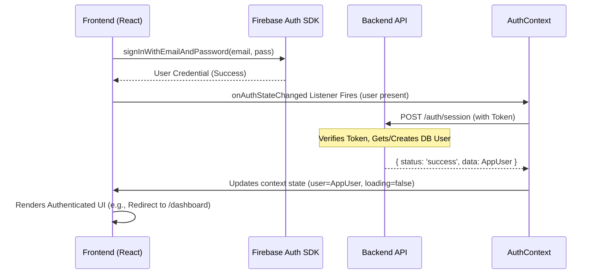
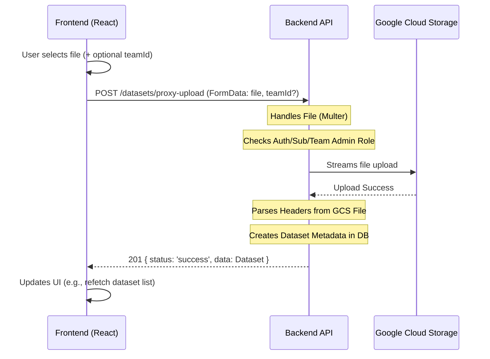
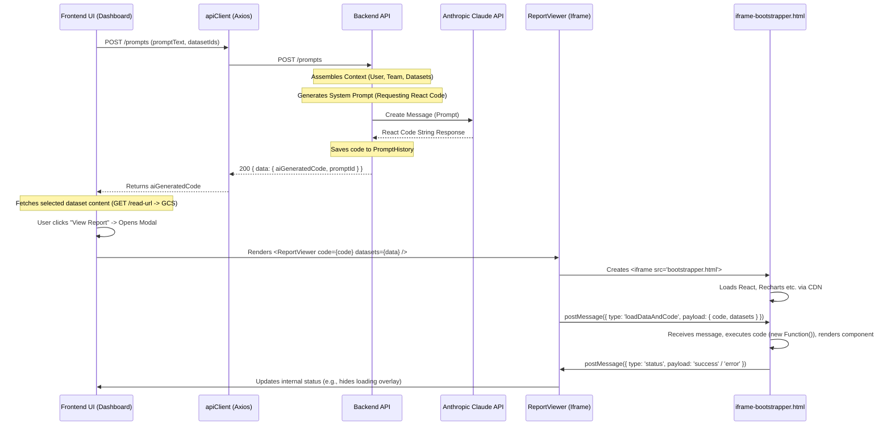
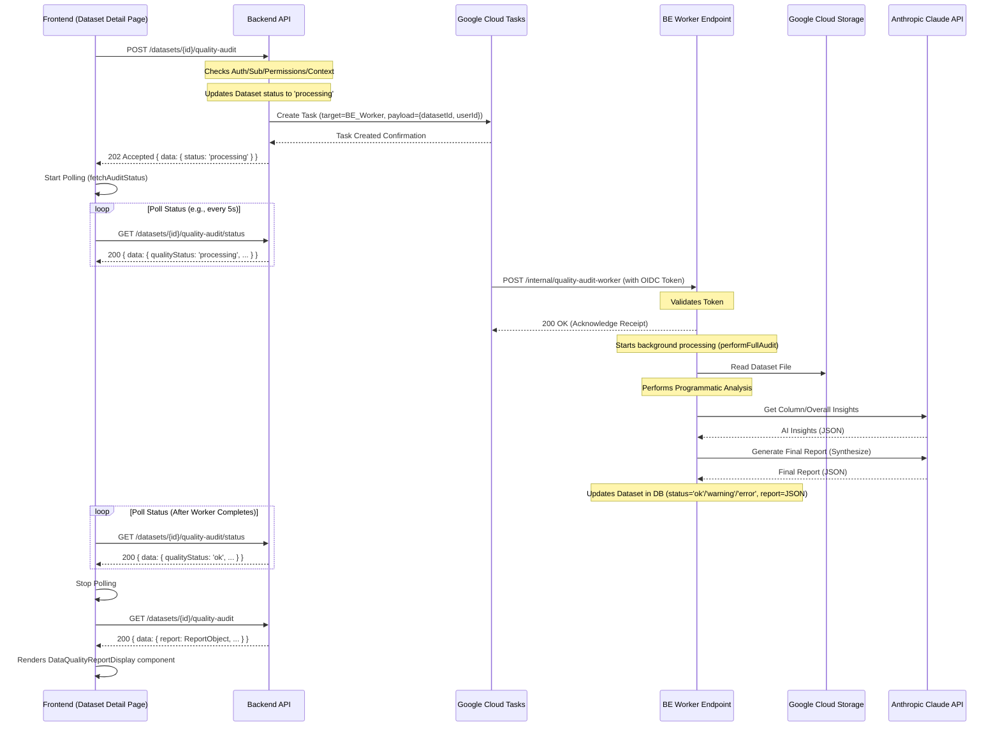
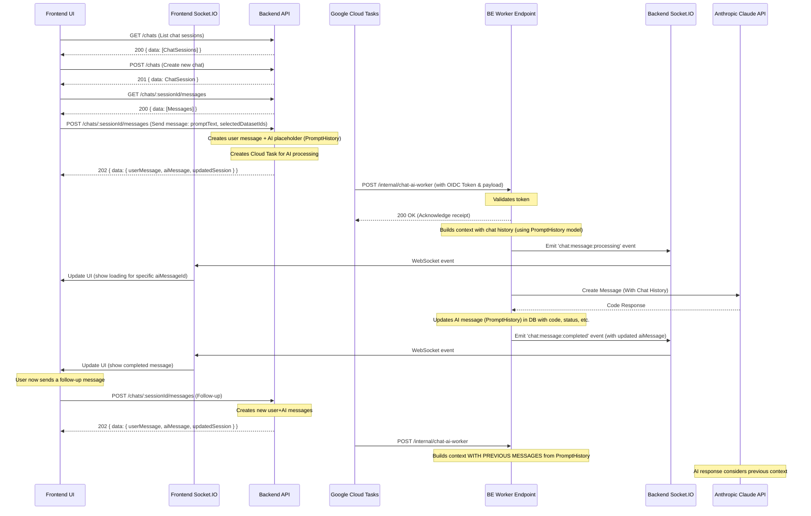

# NeuroLedger Application Architecture

**Last Updated:** April 7, 2024

## 1. Overview

NeuroLedger is a web application designed for AI-powered financial analysis. It comprises a React frontend and a Node.js/Express backend, interacting via a RESTful API. The architecture emphasizes modularity through a Vertical Slice Architecture (VSA) pattern implemented in both the frontend and backend codebases.

*   **Frontend:** React (using Vite), Tailwind CSS, React Router, Axios, Firebase JS SDK.
*   **Backend:** Node.js, Express, MongoDB (with Mongoose), Firebase Admin SDK, Google Cloud Storage (GCS), Google Cloud Tasks, Anthropic Claude API Client.
*   **Core Pattern:** Vertical Slice Architecture (VSA).

## 2. High-Level Structure

The project is divided into two main packages:

*   **`frontend/`**: Contains the React single-page application (SPA). See `frontend/README.md` for setup and structure details.
*   **`backend/`**: Contains the Node.js/Express API server. See `backend/README.md` for setup and structure details.

Interaction between these two parts is defined by the API contract documented in `frontend/FE_BE_INTERACTION_README.md`.

## 3. Backend Architecture (`backend/`)

The backend follows a VSA pattern, organizing code by feature slices rather than technical layers.

```mermaid
graph TD
    A[Client Request] --> B(Express App);
    B --> C{Middleware Chain};
    C -- CORS, JSON, Logging --> D{Auth Middleware};
    D -- /api/v1/** --> E{Subscription Middleware};
    E -- /api/v1/** --> F(Feature Router);
    F -- /api/v1/featureX --> G[Feature X Controller];
    G --> H(Feature X Service);
    H --> I{Database (MongoDB)};
    H --> J(External APIs);
    H --> F;  // Response back up chain
    G --> F;
    F --> E;
    E --> D;
    D --> C;
    C --> B;
    B --> K[Client Response];

    subgraph Global Middleware
        C
        D
        E
    end

    subgraph Feature Slice (e.g., ./src/features/datasets)
        G
        H
    end

    subgraph Shared Infrastructure (./src/shared)
        I
        J
        L(Error Handler)
    end

    %% Error Flow
    G -- Error --> L;
    H -- Error --> L;
    F -- Error --> L;
    E -- Error --> L;
    D -- Error --> L;
    C -- Error --> L;
    L --> B;
```

*   **Entry Point:** `backend/src/server.js` initializes the database connection (`./shared/db/connection.js`) and starts the Express server defined in `app.js`.
*   **Application Core (`backend/src/app.js`):** Configures the Express app instance, applies global middleware (CORS, JSON parsing, request logging), mounts the main API router (`./routes.js`) under `/api/v1`, and sets up the global error handler (`./shared/middleware/error.handler.js`). See `backend/src/README.md`.
*   **Routing (`backend/src/routes.js`):** Aggregates and mounts routers from individual feature slices onto specific sub-paths (e.g., `/auth`, `/datasets`, `/teams`).
*   **Middleware (`backend/src/shared/middleware/`)**:
    *   `auth.middleware.js` (`protect`): Verifies Firebase ID token, attaches `req.user`. See `README.md`.
    *   `subscription.guard.js` (`requireActiveSubscription`): Checks `req.user` for active subscription status. See `README.md`.
    *   `cloudTask.middleware.js` (`validateCloudTaskToken`): Validates OIDC tokens for requests from Cloud Tasks. See `README.md`.
    *   `error.handler.js`: Global error handling. See `README.md`.
    *   Feature-specific middleware (e.g., `backend/src/features/teams/team.middleware.js`) handles role checks like `isTeamMember`, `isTeamAdmin`.
*   **Features (`backend/src/features/`)**: Contains self-contained feature logic (controllers, services, models, routes). See `backend/src/features/README.md` and individual feature READMEs for details on:
    *   `auth`: Session creation/verification.
    *   `chat`: Persistent chat history with contextual AI responses.
    *   `dataQuality`: Asynchronous dataset audits using Cloud Tasks.
    *   `datasets`: Metadata management, upload coordination (direct & proxy), access control.
    *   `notifications`: Creating and managing user notifications.
    *   `prompts`: AI interaction (Claude) for code generation.
    *   `subscriptions`: Dummy subscription management.
    *   `teams`: Team creation, membership, invites, settings.
    *   `users`: User profile and settings management.
*   **Shared Modules (`backend/src/shared/`)**: Provides common infrastructure. See `backend/src/shared/README.md` and subdirectory READMEs for details on:
    *   `config`: Environment variable loading and validation.
    *   `db`: MongoDB connection setup.
    *   `external_apis`: Initialized clients for Firebase Admin, GCS, Claude. **Requires service account files in `backend/` root.**
    *   `utils`: Logging setup (`logger.js`).
*   **Database Models:** Mongoose schemas are defined within their respective feature slices (e.g., `backend/src/features/users/user.model.js`, `backend/src/features/datasets/dataset.model.js`). Key models include `User`, `Dataset`, `Team`, `TeamMember`, `TeamInvite`, `Notification`, `PromptHistory`. Relationships are established via `mongoose.Schema.Types.ObjectId` refs.
*   **Asynchronous Tasks:** The application uses Google Cloud Tasks (`@google-cloud/tasks`) for long-running background processing:
    *   **Data Quality Audit:** Initiated via `POST /datasets/:id/quality-audit` and handled by `POST /internal/quality-audit-worker`.
    *   **Chat AI Generation:** Initiated via `POST /chats/:sessionId/messages` and handled by `POST /internal/chat-ai-worker`.
    *   See `backend/src/features/dataQuality/README.md` and `backend/src/features/chat/README.md` for implementation details.

## 4. Frontend Architecture (`frontend/`)

The frontend is a React SPA built with Vite, styled with Tailwind CSS, following VSA principles.

```mermaid
graph LR
    A[User Interaction] --> B(React Components);
    B --> C{Routing (React Router)};
    C --> D[Layout Components];
    D --> E(Page Components);
    B --> F(State Management);
    F -- Global --> G[Context API (Auth, Theme)];
    F -- Local --> H[Component State (useState)];
    F -- Feature --> I[Custom Hooks (useFeatureX)];
    B --> J{API Calls};
    J --> K(apiClient - Axios);
    K -- Request Interceptor --> L(Add Auth Token);
    L --> M[Backend API];
    M --> K;
    K -- Response Interceptor --> J;
    J --> F; %% Update State
    J --> B; %% Update UI

    subgraph Core Structure (./src)
        C
        D
        G
        K
    end

    subgraph Features (./src/features)
        E
        I
        %% Specific Components
    end

    subgraph Shared (./src/shared)
       %% Shared Components
       %% Shared Hooks (useAuth, useTheme)
       %% UI Elements
    end
```

*   **Build Tool:** Vite (`frontend/vite.config.js`) provides fast development server and optimized production builds.
*   **Entry Point:** `frontend/index.html` is the root HTML file. `frontend/src/main.jsx` renders the React application using `ReactDOM.createRoot`.
*   **Root Component (`frontend/src/App.jsx`):** Sets up global context providers (`AuthProvider`, `ThemeProvider`). Renders the main router (`AppRouter`). See `frontend/src/README.md`.
*   **Routing (`frontend/src/routes.jsx`):** Uses `react-router-dom` v6 (`createBrowserRouter`) to define all application routes.
    *   Implements protected route logic (`ProtectedRoute`) checking auth and subscription status.
    *   Uses layout components (`AppLayout`, `CenteredLayout`) for different route groups.
    *   Lazy loads most page components using `React.lazy` and `Suspense`. See `frontend/src/README.md`.
*   **Layouts (`frontend/src/shared/layouts/`):**
    *   `AppLayout.jsx`: Main layout for authenticated users, includes `Sidebar` and sticky header. Manages sidebar collapse state. Integrates `NotificationBell` and `TutorialModal`.
    *   `CenteredLayout.jsx`: Split-screen layout for public pages (Login, Signup).
    *   See `frontend/src/shared/layouts/README.md`.
*   **State Management:**
    *   **Global:** React Context API for authentication (`AuthContext`) and theme (`ThemeContext`). Consumed via `useAuth` and `useTheme` hooks (`frontend/src/shared/hooks/`). See context and hook READMEs.
    *   **Feature/Server State:** Often managed within feature-specific custom hooks (e.g., `useDatasets`, `useTeamInvites`, `useChat`, `useNotifications`) that handle API calls, loading, and error states. SWR or React Query could be alternatives for more complex caching/refetching needs.
    *   **Local UI State:** Managed within components using `useState`, `useReducer`.
*   **API Interaction (`frontend/src/shared/services/apiClient.js`):**
    *   An `axios` instance is configured with the base backend URL (`VITE_API_BASE_URL`).
    *   A **request interceptor** automatically attaches the Firebase Auth ID token (`Authorization: Bearer`) to outgoing requests.
    *   A response interceptor provides basic error logging (e.g., for 401s).
    *   See `frontend/src/shared/services/README.md`.
*   **Styling:**
    *   Tailwind CSS is the primary styling engine (`frontend/tailwind.config.js`).
    *   Dark mode is implemented using Tailwind's `class` strategy, managed by `ThemeContext`.
    *   Global styles and custom Tailwind layers are defined in `frontend/src/index.css`.
    *   Base UI components (`frontend/src/shared/ui/`) provide reusable styled elements (Button, Card, Input, Modal etc.). See `frontend/src/shared/ui/README.md` and `frontend/UI_README.md`.
*   **Features (`frontend/src/features/`)**: Contain feature-specific pages, components, and hooks. See `frontend/src/features/README.md` and individual feature READMEs for details on:
    *   `account_management`: Layout/navigation for account sections.
    *   `auth`: Login/Signup forms and pages.
    *   `chat`: Persistent chat interface with history and real-time updates.
    *   `dashboard`: Main chat interface, prompt input, report display trigger.
    *   `dataQuality`: Components for displaying audit status and reports.
    *   `dataset_management`: Dataset upload, list, detail page, context editor.
    *   `notifications`: Notification bell and list display.
    *   `onboarding`: Tutorial modal logic.
    *   `report_display`: Iframe sandbox for rendering AI-generated React code.
    *   `subscription`: Dummy plan selection page.
    *   `team_management`: Team creation, list, details, member/invite management.
*   **Report Rendering (`frontend/src/features/report_display/`)**:
    *   Uses a **sandboxed iframe** approach for security when executing AI-generated code.
    *   `ReportViewer.jsx` creates an `<iframe>` with `sandbox="allow-scripts"`, loading `public/iframe-bootstrapper.html`.
    *   Code and data are passed into the iframe using `postMessage`.
    *   `iframe-bootstrapper.html` loads React/libraries via CDN, executes the received code, renders the component within the iframe, and sends status back via `postMessage`.
    *   See `frontend/src/features/report_display/README.md`.

## 5. Key Interaction Flows

### Authentication Flow



### Dataset Proxy Upload Flow



### Prompt & Report Flow (Code Gen + Iframe)



### Data Quality Audit Flow



### Chat Flow (Persistent Sessions)



## 6. Environment & Configuration

*   Both frontend and backend rely on environment variables for configuration (API keys, database URIs, service URLs, etc.).
*   `.env` files are used for local development (see `.env.example` in both `frontend/` and `backend/`).
*   Frontend variables must be prefixed with `VITE_` (e.g., `VITE_FIREBASE_API_KEY`). See `frontend/README.md`.
*   Backend configuration is loaded via `backend/src/shared/config/index.js`, which validates required variables. See `backend/src/shared/config/README.md`.
*   Backend requires service account JSON files (`firebase-service-account.json`, `gcs-service-account.json`) placed in the `backend/` root directory for local development (see Security Note in `backend/src/shared/external_apis/README.md`).

This document provides a high-level blueprint. For specific implementation details, refer to the linked README files within each feature and shared module directory.
